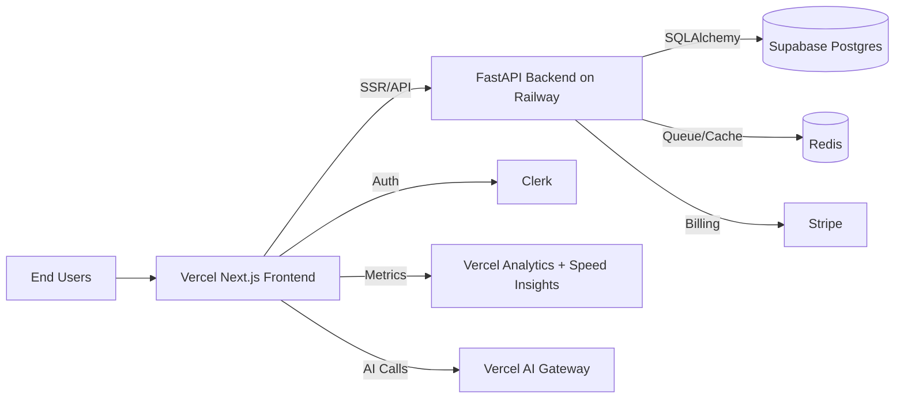
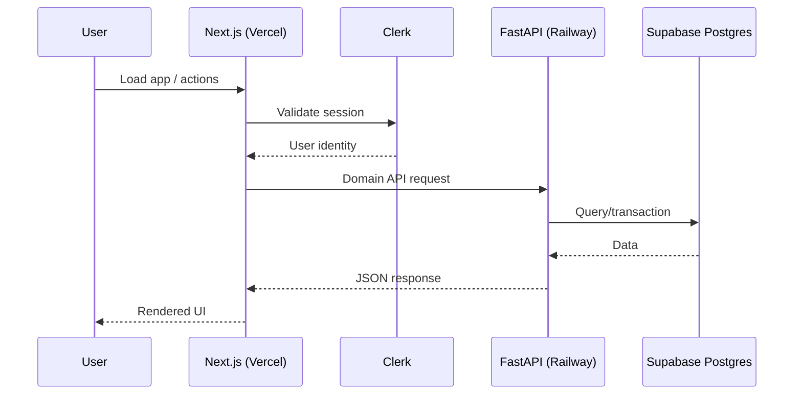
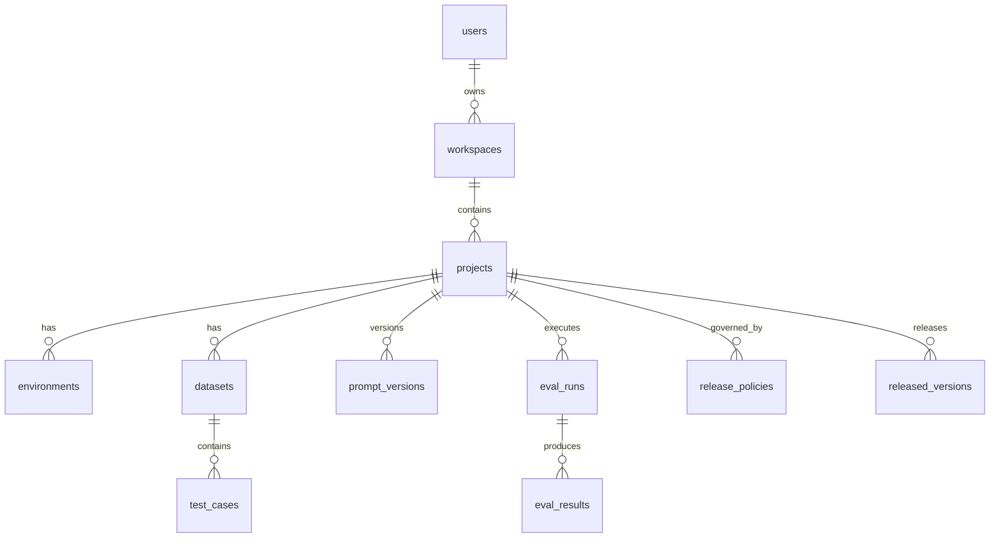
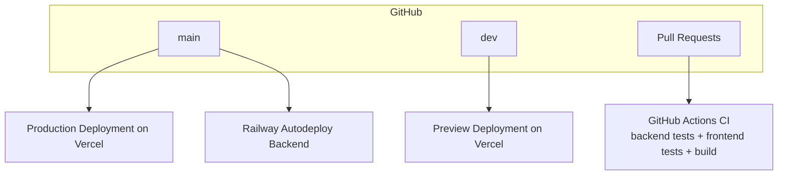

# Mythareon Architecture and Delivery Plan

## 1) System Overview

Mythareon is a two-tier platform:
- Frontend: Next.js app on Vercel (UI, API routes for cron and AI gateway)
- Backend: FastAPI service on Railway (domain APIs, persistence, async processing)
- Data: Supabase Postgres as system of record, Redis for queue/cache
- External providers: Clerk (auth), Stripe (billing), OpenAI/Anthropic via AI Gateway

## 2) Target Design Principles

- Deterministic builds: pinned dependencies, explicit scripts, repeatable CI
- Environment separation: local, preview, production with explicit env values
- Deploy resilience: backend should boot even if DB is temporarily unavailable
- Test gates: backend and frontend tests run on every push/PR
- Minimal ops burden: simple make targets and migration flow

## 3) High-Level Architecture

## 4) Runtime Request Flow

## 5) Data Model Overview

## 6) Deployment Topology

## 7) Full Delivery Plan

### Phase A: Foundation (Done)
- Monorepo structure for frontend/backend
- Vercel project config and production deployment
- Railway startup hardening and root config
- Supabase SSR client wiring

### Phase B: Engineering Readiness (In Progress)
- Add architecture document with diagrams
- Add Makefile for deterministic local/CI commands
- Add migration tooling (Alembic)
- Add backend and frontend smoke tests
- CI runs tests and build checks

### Phase C: Product Maturity (Next)
- Expand tests from smoke to behavior coverage
- Add authenticated flows and RLS-aware queries
- Add release policy logic and eval result gating
- Add versioned release process and changelog automation

## 8) Deterministic Build/Validation Contract

Required checks before merge to main:
- Backend: dependency install + pytest + app import smoke
- Frontend: npm ci + vitest + next build
- Infra config: no unresolved env placeholders in deployment envs

Required checks before production deploy:
- Vercel build green on main
- Railway deployment health endpoint healthy
- Supabase connectivity verified

## 9) Environment Matrix

| Environment | Frontend | Backend | Database | Purpose |
|---|---|---|---|---|
| local | Next dev | Uvicorn | local or Supabase | feature development |
| preview | Vercel preview | Railway preview/service env | Supabase | PR validation |
| production | mythareon.vercel.app | Railway prod service | Supabase prod project | live traffic |

## 10) Operational Runbook

- Backend health endpoint: `/api/health`
- Vercel cron endpoint: `/api/cron` protected by `CRON_SECRET`
- AI endpoint: `/api/ai` uses `AI_GATEWAY_API_KEY`
- If Railway boots but DB unavailable, app remains up and logs warning

## 11) Service Boundaries and API Domains

Frontend responsibilities (Next.js on Vercel):
- Marketing and product UX at `/`
- Auth-aware workspace surfaces
- Thin API routes for platform edge concerns (cron, AI gateway passthrough)

Backend responsibilities (FastAPI on Railway):
- Project/workspace domain APIs
- Dataset and test case lifecycle APIs
- Evaluation run orchestration and result persistence
- Release policy enforcement and release-history audit trail

Boundary rule:
- Product domain state is owned by backend APIs, not by frontend API routes
- Frontend API routes are only for edge integrations and lightweight orchestration

## 12) Security and Data Controls

Authentication and authorization:
- Clerk identity is validated at the edge and passed to backend as trusted identity context
- Backend performs workspace/project access checks on every domain mutation

Secrets handling:
- Secrets are environment-injected only (Vercel/Railway/Supabase), never committed
- Required secrets include Clerk keys, DB URL, Redis URL, Stripe secret, and AI gateway key

Data controls:
- Supabase Postgres is system of record with least-privilege DB role usage
- PII in logs is minimized and redacted where possible
- Release decisions and evaluation outcomes are persisted for auditability

## 13) Reliability and Failure Strategy

Current strategy:
- Backend startup is fail-soft for transient DB outages
- Health endpoint remains available for platform diagnostics

Target strategy:
- Add readiness endpoint that checks DB + Redis connectivity for deploy gating
- Apply retry with jitter around external provider calls (AI, billing)
- Add idempotency keys for release and evaluation-triggering actions

Failure mode expectations:
- DB unavailable at boot: app serves degraded mode and logs warning
- AI provider outage: mark run as provider-failed with retry metadata
- Cron secret mismatch: explicit unauthorized response with no side effects

## 14) Performance and Scaling Plan

Web tier:
- Serve static/SSR pages from Vercel edge where possible
- Keep first-load payload lean and avoid large client bundles on marketing routes

API tier:
- Move long-running evaluation work to async workers (Redis/Celery path)
- Keep request/response APIs short-lived and status-driven

Data tier:
- Add indexes for high-frequency lookup paths (project_id, dataset_id, eval_run_id)
- Use pagination and cursor patterns for large eval result sets

## 15) SLOs and Monitoring Targets

Initial SLOs:
- API availability (monthly): 99.5%
- p95 domain API latency: under 500ms for non-eval endpoints
- Eval completion success rate: 98% for accepted runs

Alerting triggers:
- `/api/health` failure for 3 consecutive checks
- Error rate spike above baseline for 5 minutes
- Eval run queue age above threshold

Observability baseline:
- Vercel Analytics and Speed Insights for frontend
- Structured backend logs with request IDs
- Run-level trace metadata for evaluation jobs

## 16) Delivery Milestones and Ownership

Milestone 1 (Now):
- Stable landing page and deterministic local build/test loop
- CI checks green for backend/frontend

Milestone 2 (Next):
- End-to-end eval workflow with release verdict persistence
- Authenticated workspace flows and access control hardening

Milestone 3 (Beta):
- Async eval workers, richer behavior tests, and incident playbook readiness
- Design partner onboarding and feedback-driven roadmap updates

## 17) Exit Criteria for "Ready"

- CI green on main
- Local build and tests pass
- Vercel production deployed and serving
- Railway deployment healthy
- Architecture and runbook documented
- Security/env checklist completed for production
- At least one end-to-end eval regression scenario validated in CI
